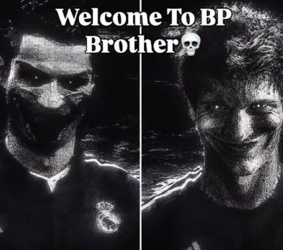

# AuraFarm App

<div align="center">



### 💀 Приложение для поднятия самоуверенности и развития синдрома бога 💀

[](https://www.python.org/)
[](https://opencv.org/)
[]()
[](LICENSE)

</div>

---

## Описание проекта

**AuraFarm App** — это интерактивное десктопное приложение для прокачки вайба, поднятия самоуверенности и развития синдрома бога. 

Приложение подключается к веб-камере в реальном времени, отслеживает лицо пользователя с помощью сверхбыстрой нейросети (OpenCV YuNet), захватывает высококачественные фотографии и видео-фрагменты, после чего автоматически монтирует и воспроизводит динамичные **Brazilian Phonk эдиты** в стиле TikTok и CapCut в окне *"aura here"*.

---

## Основные возможности

- **Real-Time Face Tracking**: Высокоскоростное распознавание лица на базе глубоких сверточных сетей (YuNet ONNX) со сглаживанием координат и частотой 60+ FPS.
- **Cyberpunk HUD & Aura Box**: Тонкая неоновая пульсирующая рамка захвата цели с анимированной линией сканирования и индикатором фарма ауры.
- **Green Screen Chroma Keying**: Встроенный высокопроизводительный движок хромакеинга (HSV + антиалиасинг + green de-spill), бесшовно заменяющий зеленый фон в шаблонах на ваши реальные фотографии и видеоряд.
- **Live Video Buffer + Photo Snapshots**: Захват как четких стоп-кадров лица в момент вспышки затвора, так и динамичного видео-буфера живых движений (до 8 слотов на эдит).
- **Синхронизация с бразильским фонком**: Аутентичные саундтреки, динамичные зум-панчи (punch zoom), RGB-аберрации (chromatic split) и вспышки на дропах.
- **Автономный цикл и автоочистка**: Автоматическая ротация шаблонов, кулдаун между дропами и полная очистка временных файлов.
- **Поддержка экспортов CapCut**: Автоматический подхват готовых `.mp4` видео из папки `Downloads` или `CapCut_Edits_Input`.

---

## Архитектура и стек технологий

| Модуль | Технологии | Назначение |
|---|---|---|
| **Ядро приложения** | `Python 3.10+`, `ThreadedCamera` | Асинхронный многопоточный захват видеопотока через DirectShow (0 ms latency). |
| **Компьютерное зрение** | `OpenCV (cv2.FaceDetectorYN)`, `NumPy` | Нейросетевое отслеживание лица (YuNet ONNX), матричные преобразования, цветокоррекция. |
| **Монтажный движок** | `PhonkEditEngine` | Real-time хромакеинг, наложение альфа-каналов, зум-кривые, RGB split. |
| **Аудиодвижок** | `winsound`, `threading` | Неблокирующее фоновое воспроизведение саундтреков без лагов интерфейса. |
| **Сборщик** | `PyInstaller` | Компиляция проекта в единый независимый переносимый бинарный `.exe`. |

---

## Требования

- **Операционная система**: Windows 10 / 11 (x64)
- **Веб-камера**: Любая встроенная или USB-камера (при отсутствии камеры включается режим виртуальной демонстрации)
- **Python**: 3.10, 3.11, 3.12, 3.13 или 3.14 (при запуске из исходного кода)

---

## Быстрый старт

### 1. Клонирование репозитория
```bash
git clone https://github.com/vanyadingle/AuraFarm-App.git
cd AuraFarm-App
```

### 2. Установка зависимостей
```bash
python -m venv venv
venv\Scripts\activate
pip install -r requirements.txt
```

### 3. Запуск приложения
```bash
python aurafarm_app.py
```

---

## Сборка автономного .exe

Для сборки портативной версии приложения (для запуска на любых ПК без установленного Python):

```bash
python build_exe.py
```

Исполняемый файл будет скомпилирован в папку:
`dist/AuraFarmMaster/AuraFarmMaster.exe`

Для быстрого запуска можно использовать готовый батник:
```cmd
Run_AuraFarmMaster.bat
```

---

## Управление и горячие клавиши

| Клавиша | Действие |
|---|---|
| **`Q`** или **`ESC`** | Закрыть приложение и остановить все процессы. |
| **`O`** | Открыть оригинальный шаблон CapCut Web в браузере по умолчанию. |

---

## Структура проекта

```
AuraFarm-App/
├── assets/
│   ├── audio/                      # Оригинальные аудиодорожки бразильского фонка (.wav)
│   ├── greenscreen_templates/      # Шаблоны с зеленым хромакеем (.mp4)
│   ├── hair_edit/                  # Шаблон эдита с волосами и быстрой нарезкой (.mp4)
│   ├── skulls/                     # Обработанные PNG черепа с прозрачным альфа-каналом
│   ├── images/                     # Баннеры и графические ассеты
│   ├── face_detection_yunet.onnx   # ONNX нейромодель детекции лиц YuNet
│   └── icon.ico                    # Иконка приложения
├── aurafarm_app.py                 # Главное GUI приложение и цикл событий
├── edit_engine.py                  # Движок хромакеинга, монтажа и процедурных эффектов
├── face_tracker.py                 # Модуль нейросетевого трекинга лица и отрисовки кибер-HUD
├── audio_player.py                 # Асинхронный неблокирующий аудиоплеер
├── build_exe.py                    # Скрипт автоматической сборки в PyInstaller
├── Run_AuraFarmMaster.bat          # Ярлык быстрого запуска
├── requirements.txt                # Список зависимостей Python
├── .gitignore                      # Исключения версионирования
└── README.md                       # Документация проекта
```

---

## TODO

- [ ] **Улучшить подстановку фотографий в видеоряд эдита** — расширение адаптивного масштабирования и автоцентрирования по ключевым точкам лица.
- [ ] **Замена фотографий подстраивается под звук эдита, что будет обеспечивать динамичность** — добавление спектрального анализа аудио в реальном времени (FFT / onset detection) для мгновенной нарезки кадров точно в транзиенты и пики бочки (808 kick).
- [ ] **Поддержка CapCut эдитов** — прямая генерация и модификация файлов черновиков CapCut Desktop (`draft_content.json`) для рендера через оригинальный движок ByteDance.
- [ ] **Дополнительные паки звуковых эффектов** — интеграция новых Brazilian Phonk / Funk Sigilo саундпаков.
- [ ] **Экспорт готовых клипов** — автоматическое сохранение финального сгенерированного эдита в галерею с возможностью мгновенной публикации.

---

## Лицензия

Этот проект распространяется под лицензией MIT. Подробности в файле [LICENSE](LICENSE).
